# Draftwell Pro

  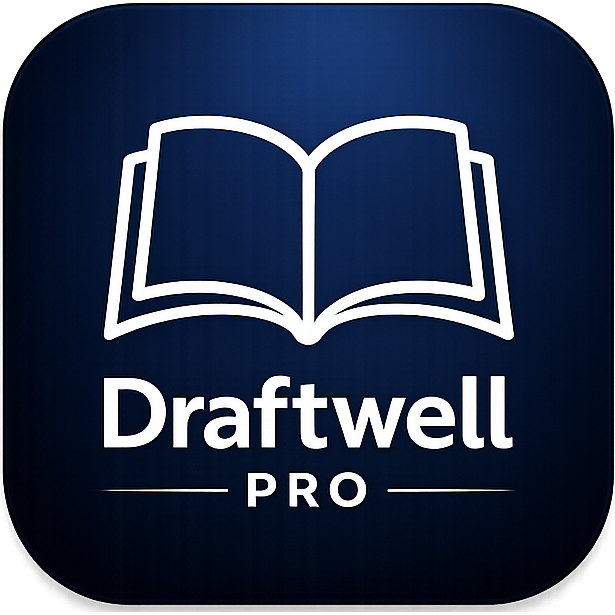

<strong>Write the book. All of it.</strong>

  Draftwell Pro is a local desktop app that organizes your book, tracks your time, analyzes your prose, and manages your submission pipeline — all on your own machine, with no subscription and no AI.

  
  
  
  
  

---

## Download

**[Download Installer for Windows](https://github.com/draftwellpro/Draftwell-Pro/releases/latest)**

**[Download for macOS](https://github.com/draftwellpro/Draftwell-Pro/releases/latest)** — macOS 12+ · Apple Silicon (arm64)

---

## Features
For a full feature walkthrough, visit **[draftwellpro.github.io/Draftwell-Pro](https://draftwellpro.github.io/Draftwell-Pro/)**.

### Writing Environment

Your book lives in a clean three-level hierarchy: **Book → Chapter → Scene**. A sidebar shows your full structure at a glance. Click a scene, write in it.

- **Rich Text Editor** — real formatting: bold, italic, headings, lists
- **Auto-Save Every 5 Seconds** — changes saved automatically whenever you've written something new; you will never lose a sentence
- **Notes Per Scene & Custom Tabs** — a built-in Notes tab on every scene, plus unlimited custom tabs for research, character beats, or reference material
- **In-Editor Thesaurus** — right-click any word for synonyms; offline-first, works without internet
- **Entity Highlighting** — known characters, locations, and items glow in the editor as you type

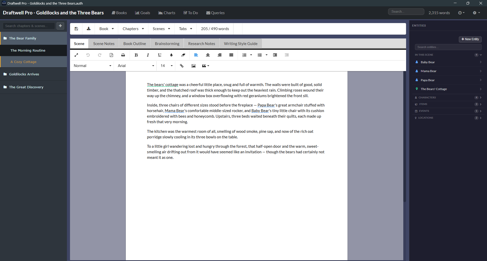

---

### Charts & Analytics

Six analytical dashboards. No guessing whether your second act is thin, your protagonist is underwritten, or your prose reads like a legal document.

**Writing Style** — a six-axis radar chart across:
- Readability (Flesch, Flesch-Kincaid, ARI, Coleman-Liau, Gunning Fog, SMOG)
- Vocabulary (MATTR and diversity metrics)
- Rhythm
- Style (Adverb Density, Filler Word %, Dialogue Ratio)
- Pacing (Pacing Index)
- Vitality

**Story Structure** — words-per-chapter bar chart with act weight distribution

**Progress** — 12-month writing activity heatmap with total words, session count, and best day

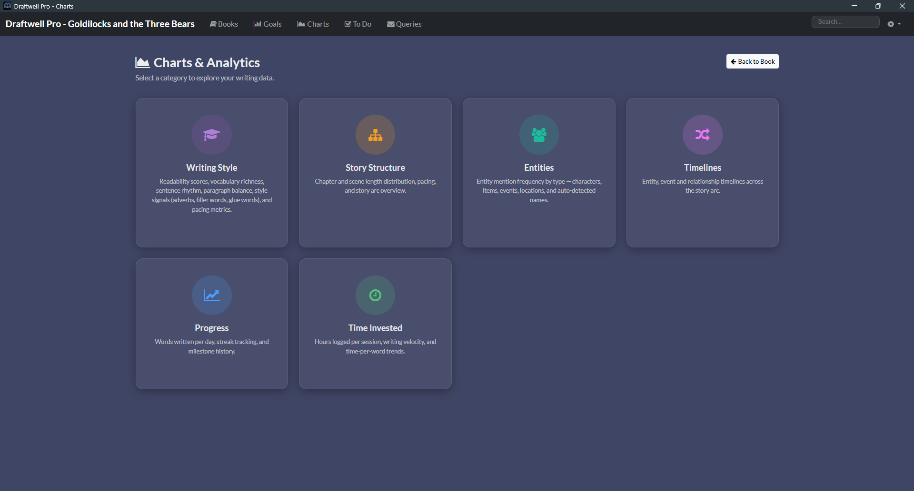

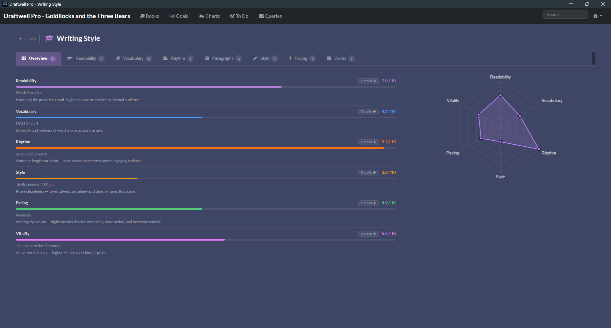

---

### Entities

Every character, location, item, and event in your story — tracked in a live panel alongside the editor. When you're writing a scene, Draftwell Pro surfaces exactly which entities appear in it.

- **Relationship Mapping** — link any entity to any other with a direction, label, in-story date, and description
- **Name Scan** — auto-detects recurring capitalized names in your prose you haven't formally defined yet
- **Mention Analytics** — see which scenes mention each entity and how often; reveals chapters where a character goes completely dark

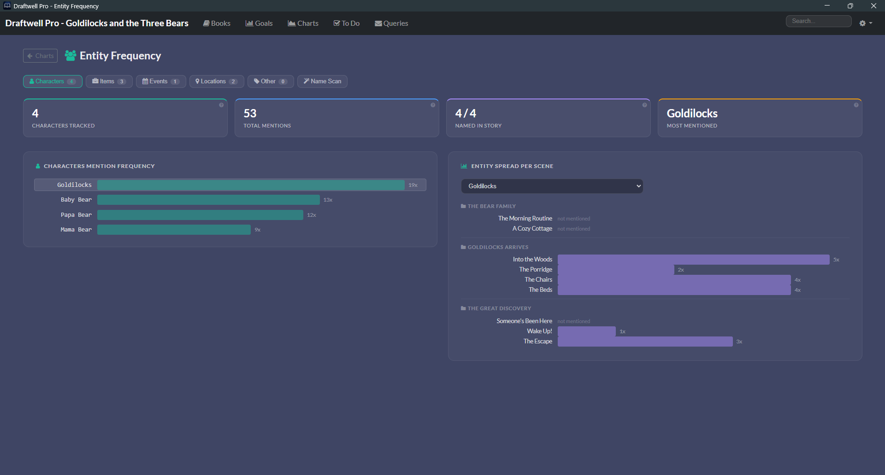

---

### Search

One search bar. Scene prose, scene names, chapter names, notes, outlines, brainstorming, entity names, relationships, and every custom research tab — all indexed, all searchable, all click-to-navigate.

- **Full Manuscript Coverage** — searches body text, chapter names, scene names, scene notes, book outline, brainstorming, and all custom tabs
- **Entity & Relationship Search** — every tracked character, location, item, event, and relationship surfaced alongside prose results
- **Click to Jump** — every result links directly to its location

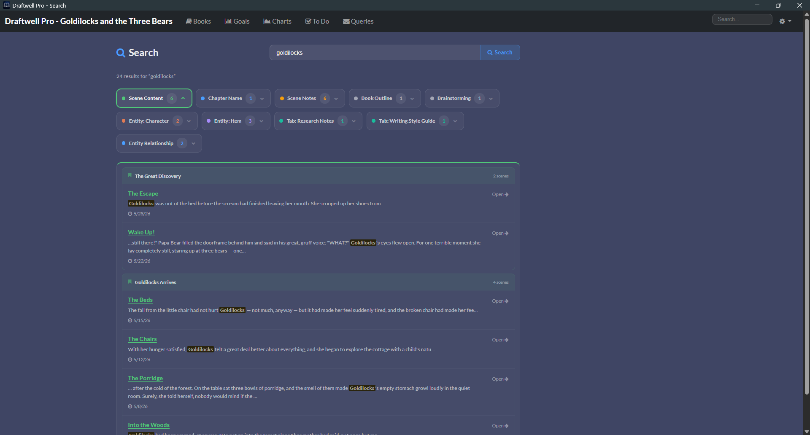

---

### Query Tracker

A full submission pipeline as a drag-and-drop Kanban board. Every agent, publisher, and contest — tracked with dates, follow-ups, and a complete paper trail.

Columns: **Research → Queried → Partial Request → Full Request → Rejected → Accepted**

- Drag cards between columns to update status
- Status changes log automatically in the comment thread
- Archive old queries without losing history
- Confetti fires on Accepted

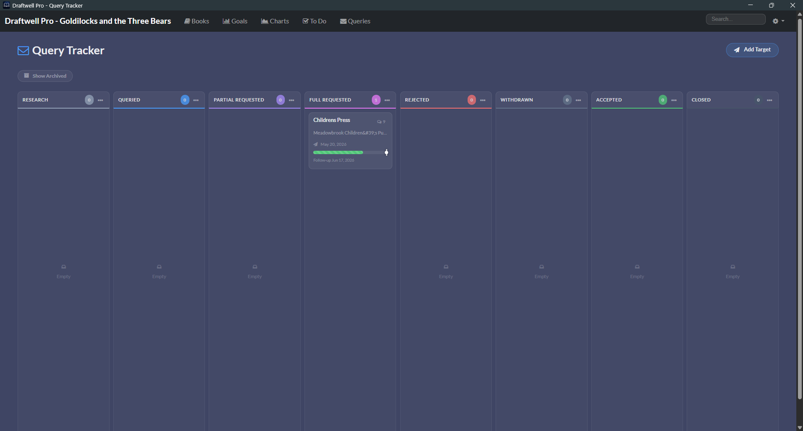

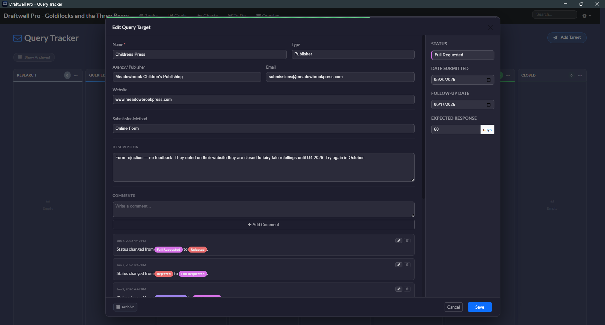

---

### Time Tracking

Draftwell Pro tracks every writing session automatically. Open a book, start typing — you're clocked in. Step away for 30 minutes — you're clocked out. No buttons to push.

- **Auto Clock-In on First Keypress** — elapsed time shows live in the top navigation bar
- **30-Minute Inactivity Timeout** — sessions end cleanly when you step away
- **Words Per Minute Velocity** — derived from word count snapshots at clock-in and clock-out

---

### Goals

Set a word count target, watch Draftwell Pro track your progress in real time as you write.

- Live progress bar that fills as you type
- Confetti fires when you cross the line
- Active & completed history kept across all sessions

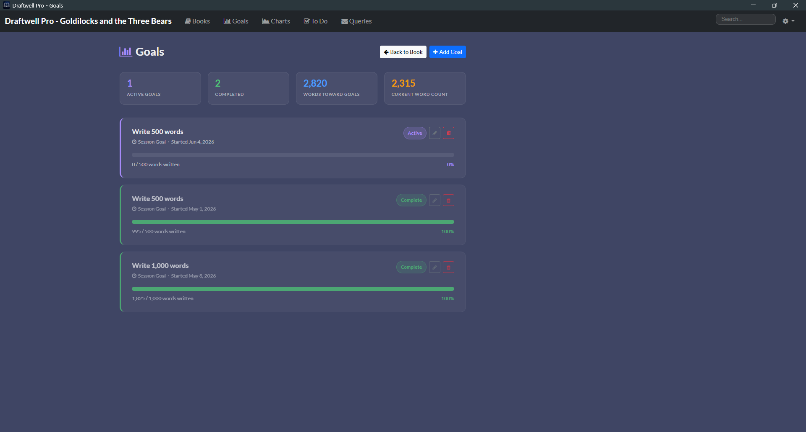

---

### To Do Board

A Kanban board for writing-adjacent work: research to finish, scenes to rewrite, people to email.

- Columns: **To Do → In Progress → Blocked → Done**
- Write a character name in a task and Draftwell Pro surfaces a direct link to that entity's detail view
- Start & due dates generate a progress bar that turns amber at 80%, red when overdue

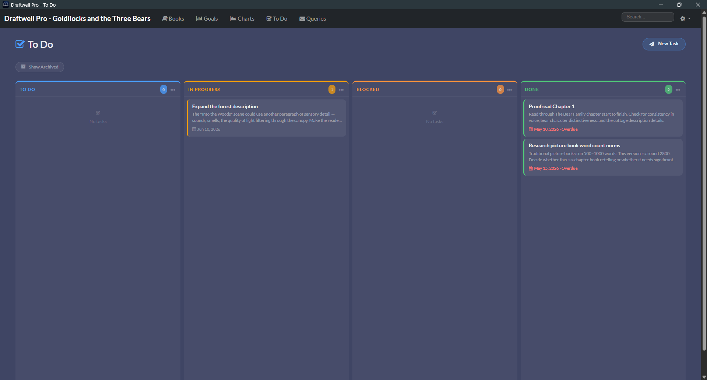

---

### Export

Export your manuscript in four formats with full control over how it looks:

| Format | Notes |
|--------|-------|
| **DOCX** | Microsoft Word — compatible with every publisher, agent, and writing workshop |
| **EPUB** | Standard ebook format with metadata, cover image, and series info |
| **HTML** | Single-file or multi-file with optional table of contents |
| **PDF** | Print-ready with optional AES-128 password protection |

Export options include: author name, copyright notice, ISBN/LoC number, fiction disclaimer, dedication, body font & size, line spacing, paragraph style, chapter heading format, scene break style, page margins, running header, table of contents, cover image, heading font & color, notes companion DOCX, and PDF password encryption.

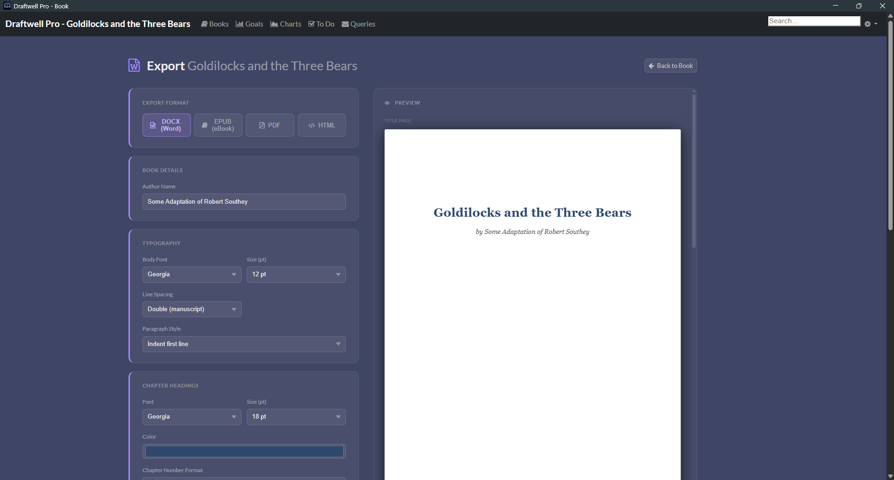

---

### Privacy

Draftwell Pro runs entirely on your own computer. Nothing is ever sent to a server. No account required. No cloud. No telemetry.

- **Local-First** — all data stays on your machine; no internet connection required to write
- **One File Per Book** — each book is a single `.auth` file; back it up, move it, copy it to a USB drive

---

### Revision History

Draftwell Pro runs a GFS (Grandfather-Father-Son) backup system automatically. Every time you open a book, a timestamped snapshot is created.

**Retention policy:** last 5 opens · 7 daily · 4 weekly · 12 monthly — capped at ~28 backups per book.

- **Side-by-Side Comparison** — browse backup history and compare any snapshot to the current version before restoring

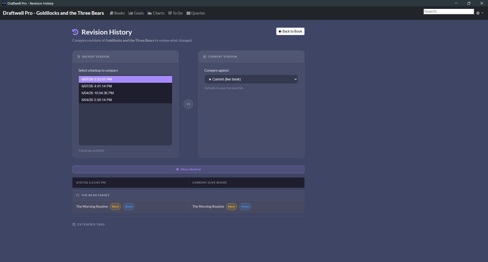

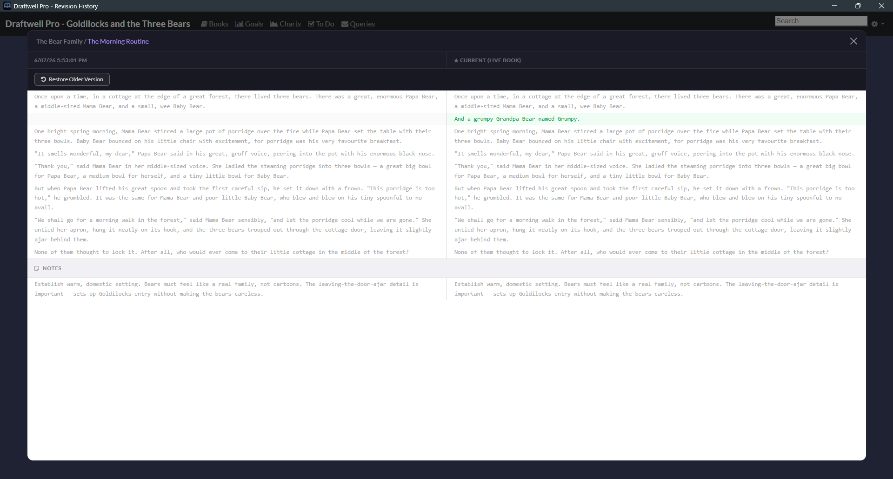

---

## What Draftwell Pro Is Not

- **Not AI** — no generated, suggested, or rewritten prose; no autocomplete; every word is yours
- **Not a Subscription** — buy once, own forever; no monthly fee, no annual renewal
- **Not Cloud-Based** — no account, no data leaves your machine, no server outage
- **Not Scrivener** — no compile step, no corkboard, no preference panels; a sidebar, an editor, and data about how you're actually writing

---

## Pricing

| | Free Trial | Full Version |
|--|-----------|-------------|
| **Price** | Free | $10 (reg. $19.99) |
| **Code** | — | `EARLYACCESS2026` for 50% off |
| **Access** | Every feature, fully unlocked for 10 hours of active writing time | Permanent — pay once, own forever |
| **Credit card** | Not required | One-time purchase |

The free trial gives you the full app on the clock — 10 hours measured while you're actively typing. All your data stays yours and can be activated anytime.

**[Download Free Trial](https://github.com/draftwellpro/Draftwell-Pro/releases/latest)**

---

*Designed by a writer, for writers.*
