# Draftwell Pro

  

<strong>Write the book. All of it.</strong>

  Draftwell Pro is a local desktop app that organizes your book, tracks your time, analyzes your prose, and manages your submission pipeline — all on your own machine, with no subscription and no AI.

  
  
  
  
  

---

## Download

**[Download Installer for Windows](https://github.com/draftwellpro/Draftwell-Pro/releases/latest)** — Windows 10 / 11 · 64-bit

**[Download for macOS](https://github.com/draftwellpro/Draftwell-Pro/releases/latest)** — macOS 12+ · Apple Silicon (arm64) - [instructions](macOS_Instructions.md)

---

## Features
For a full feature walkthrough, visit **[draftwellpro.github.io/Draftwell-Pro](https://draftwellpro.github.io/Draftwell-Pro/)**.

### Writing Environment

Your book lives in a clean three-level hierarchy: **Book → Chapter → Scene**. A sidebar shows your full structure at a glance. Click a scene, write in it.

- **Rich Text Editor** — real formatting: bold, italic, headings, lists
- **Auto-Save Every 5 Seconds** — changes saved automatically whenever you've written something new; you will never lose a sentence
- **Notes Per Scene & Custom Tabs** — a built-in Notes tab on every scene, plus unlimited custom tabs for research, character beats, or reference material
- **In-Editor Thesaurus** — right-click any word for synonyms; offline-first, works without internet
- **Entity Highlighting** — known characters, locations, and items glow in the editor as you type

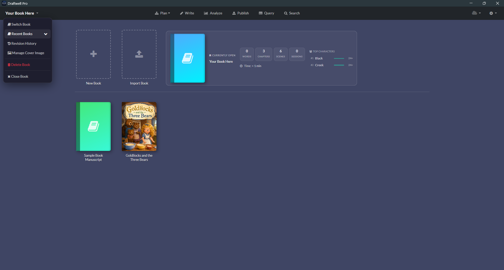

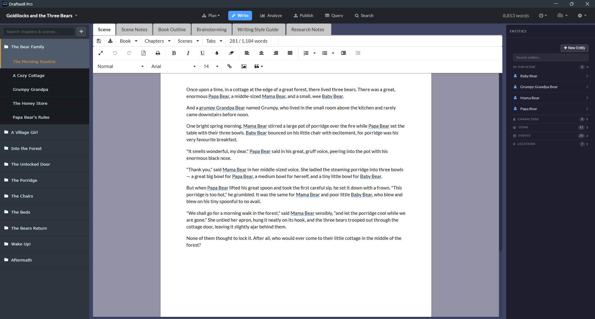

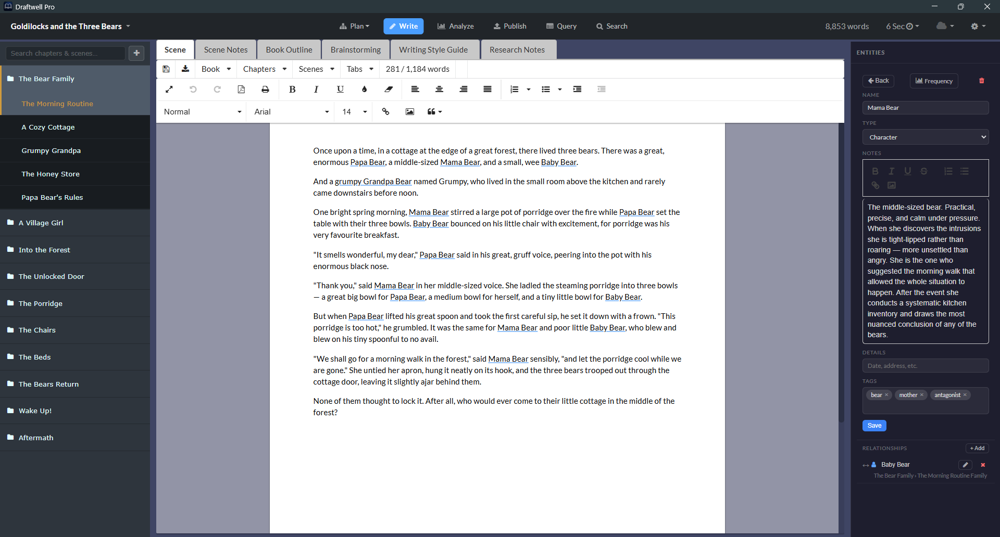

---

### Import & Outline Mode

Already have a draft? Bring it in, then plan the rest on a visual board.

- **Import from Word** — select an existing `.docx` file, configure how its headings map to chapters and scenes, and import it straight into a book's structure
- **Outline Mode** — a corkboard-style board for chapters, scenes, and synopses; drag cards to rearrange the book's structure, zoom in for detail or out for a full manuscript overview

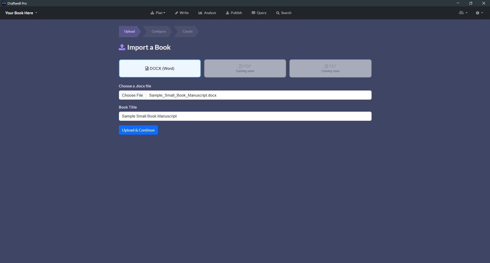

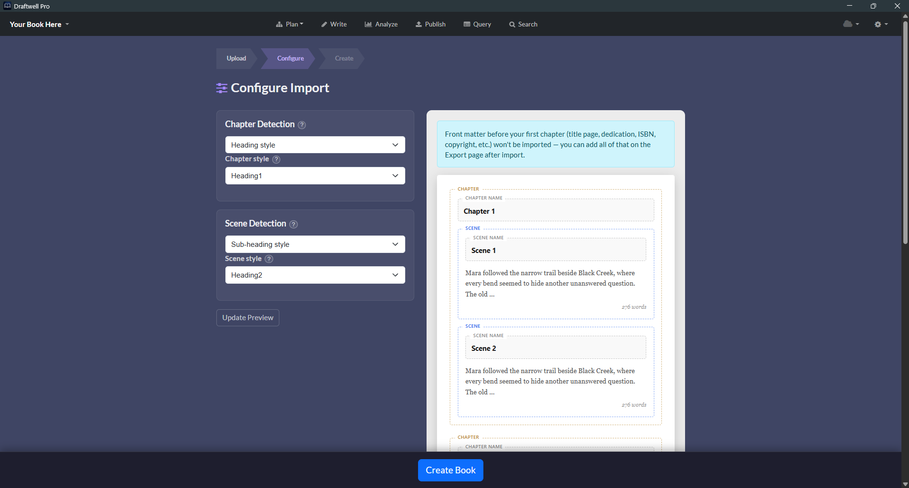

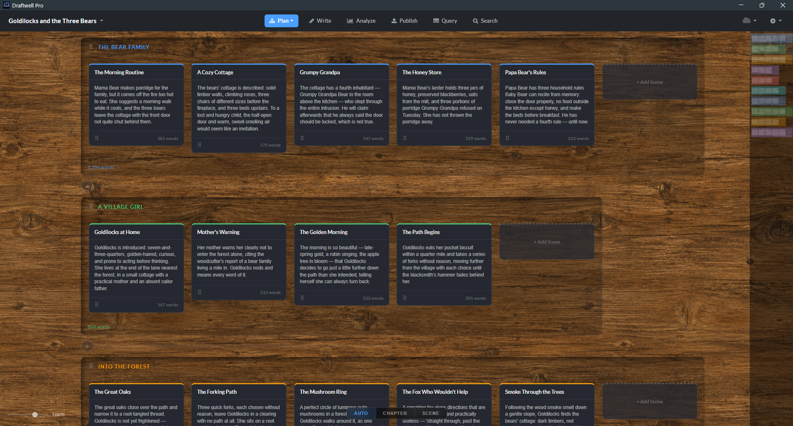

---

### Charts & Analytics

Six analytical dashboards. No guessing whether your second act is thin, your protagonist is underwritten, or your prose reads like a legal document — or like it wasn't written by you at all.

**Writing Style** — a six-axis radar chart across:
- Readability (Flesch, Flesch-Kincaid, ARI, Coleman-Liau, Gunning Fog, SMOG)
- Vocabulary (MATTR and diversity metrics)
- Rhythm
- Style (Adverb Density, Filler Word %, Dialogue Ratio)
- Pacing (Pacing Index)
- Vitality

**Story Structure** — words-per-chapter bar chart with act weight distribution

**AI Signals** — an overall AI Detection Score plus six underlying signals (Sentence Rhythm, Scene Consistency, Lexical Entropy, Hapax Richness, Phrase Variety, Transitions), scene-by-scene, so you know whether your prose reads as human-written before an agent or reader does

**Progress** — 12-month writing activity heatmap with total words, session count, and best day

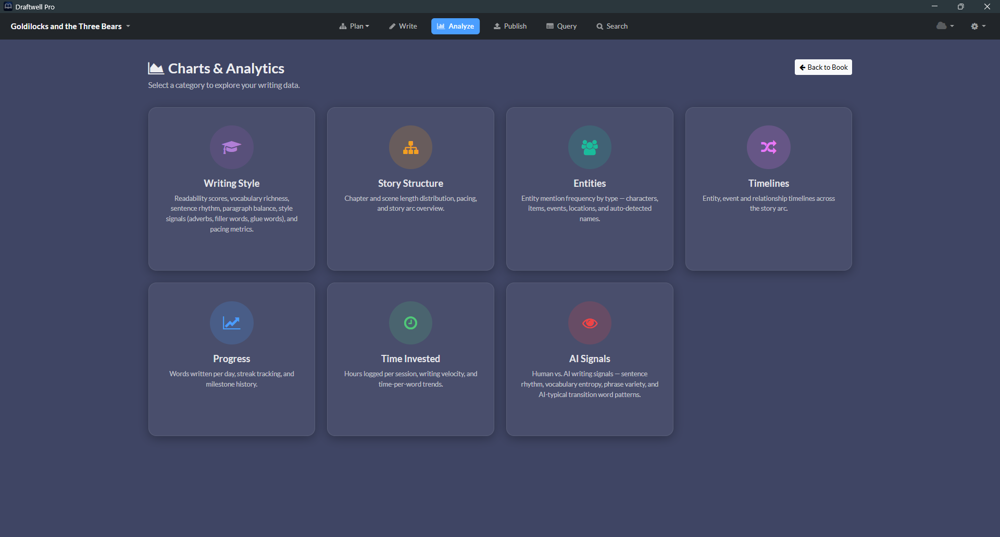

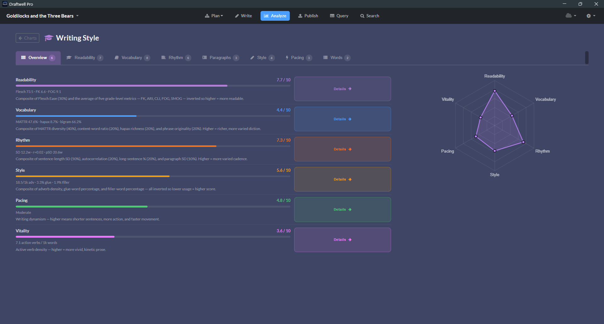

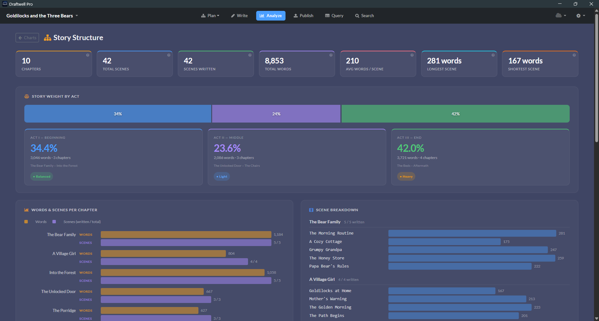

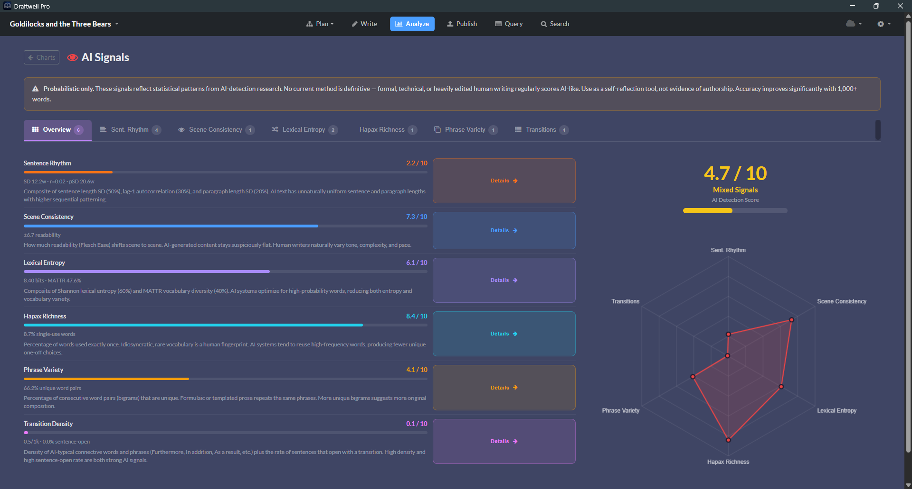

---

### Entities

Every character, location, item, and event in your story — tracked in a live panel alongside the editor. When you're writing a scene, Draftwell Pro surfaces exactly which entities appear in it.

- **Relationship Mapping** — link any entity to any other with a direction, label, in-story date, and description
- **Name Scan** — auto-detects recurring capitalized names in your prose you haven't formally defined yet
- **Mention Analytics** — see which scenes mention each entity and how often; reveals chapters where a character goes completely dark

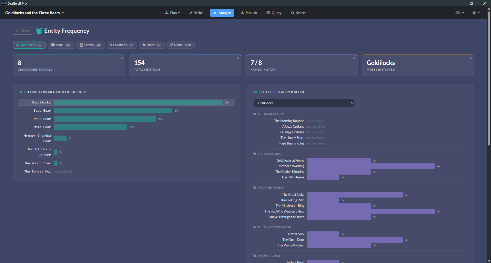

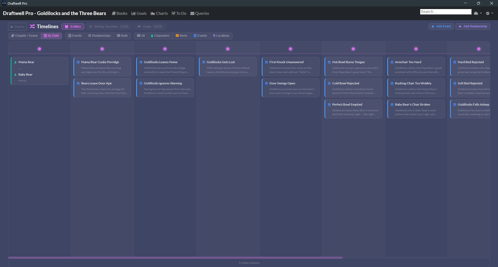

---

### Search

One search bar. Scene prose, scene names, chapter names, notes, outlines, brainstorming, entity names, relationships, and every custom research tab — all indexed, all searchable, all click-to-navigate.

- **Full Manuscript Coverage** — searches body text, chapter names, scene names, scene notes, book outline, brainstorming, and all custom tabs
- **Entity & Relationship Search** — every tracked character, location, item, event, and relationship surfaced alongside prose results
- **Click to Jump** — every result links directly to its location

---

### Query Tracker

A full submission pipeline as a drag-and-drop Kanban board. Every agent, publisher, and contest — tracked with dates, follow-ups, and a complete paper trail.

Columns: **Research → Queried → Partial Request → Full Request → Rejected → Accepted**

- Drag cards between columns to update status
- Status changes log automatically in the comment thread
- Archive old queries without losing history
- Confetti fires on Accepted

---

### Time Tracking

Draftwell Pro tracks every writing session automatically. Open a book, start typing — you're clocked in. Step away for 30 minutes — you're clocked out. No buttons to push.

- **Auto Clock-In on First Keypress** — elapsed time shows live in the top navigation bar
- **30-Minute Inactivity Timeout** — sessions end cleanly when you step away
- **Words Per Minute Velocity** — derived from word count snapshots at clock-in and clock-out

---

### Goals

Set a word count target, watch Draftwell Pro track your progress in real time as you write.

- Live progress bar that fills as you type
- Confetti fires when you cross the line
- Active & completed history kept across all sessions

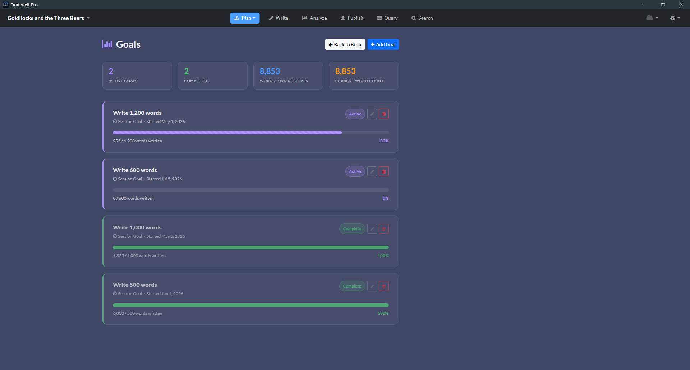

---

### To Do Board

A Kanban board for writing-adjacent work: research to finish, scenes to rewrite, people to email.

- Columns: **To Do → In Progress → Blocked → Done**
- Write a character name in a task and Draftwell Pro surfaces a direct link to that entity's detail view
- Start & due dates generate a progress bar that turns amber at 80%, red when overdue

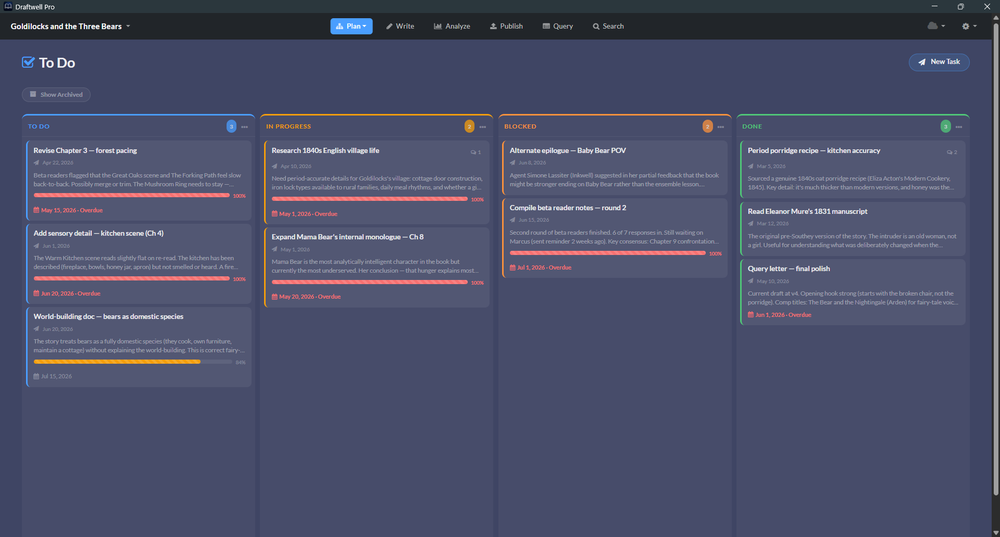

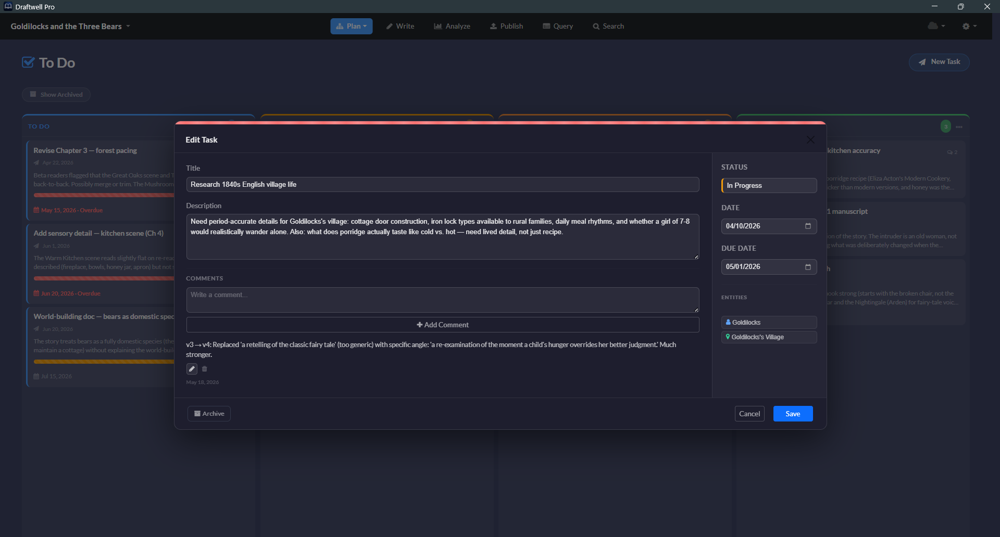

---

### Export

Export your manuscript in four formats with full control over how it looks:

| Format | Notes |
|--------|-------|
| **DOCX** | Microsoft Word — compatible with every publisher, agent, and writing workshop |
| **EPUB** | Standard ebook format with metadata, cover image, and series info |
| **HTML** | Single-file or multi-file with optional table of contents |
| **PDF** | Print-ready with optional AES-128 password protection |

Export options include: author name, copyright notice, ISBN/LoC number, fiction disclaimer, dedication, body font & size, line spacing, paragraph style, chapter heading format, scene break style, page margins, running header, table of contents, cover image, heading font & color, notes companion DOCX, and PDF password encryption.

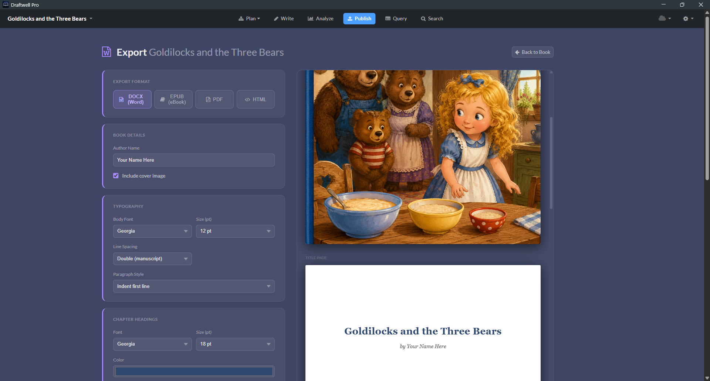

---

### Cloud Sync

Optional, opt-in backup and sync to your personal Google Drive or Dropbox. Your books go directly to your own storage — no Draftwell Pro server ever sees them.

- **Your Cloud Account** — books sync to your Google Drive or Dropbox, not to us; we never have access to your files or your account
- **Multi-Device Backup** — install on a second machine and pick up exactly where you left off; your `.auth` files follow you
- **Conflict Resolution** — edited the same book on two machines? Draftwell Pro detects the conflict and walks you through a scene-by-scene diff so you decide what to keep
- **100% Opt-In** — disabled by default; connect when you want it, disconnect whenever you like

Works with **Google Drive** and **Dropbox**.

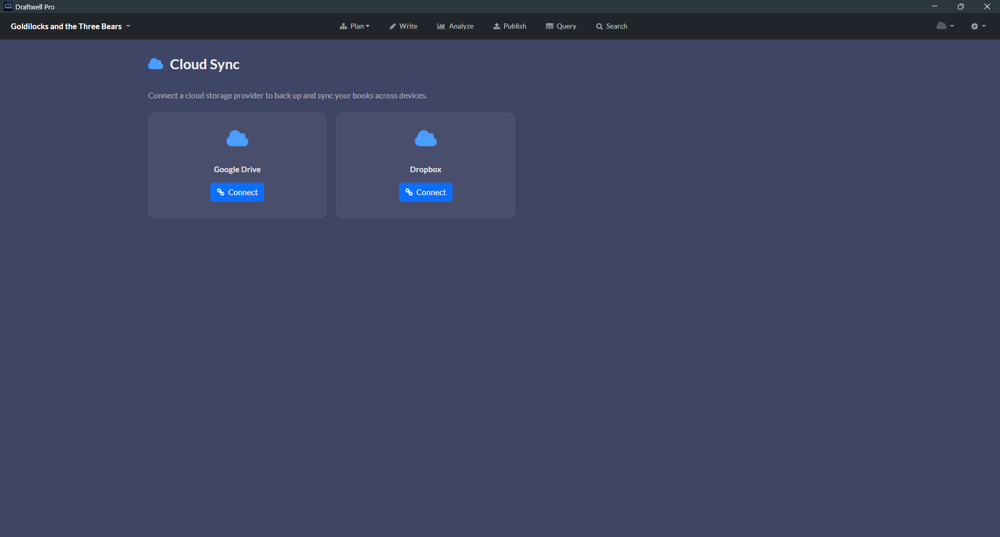

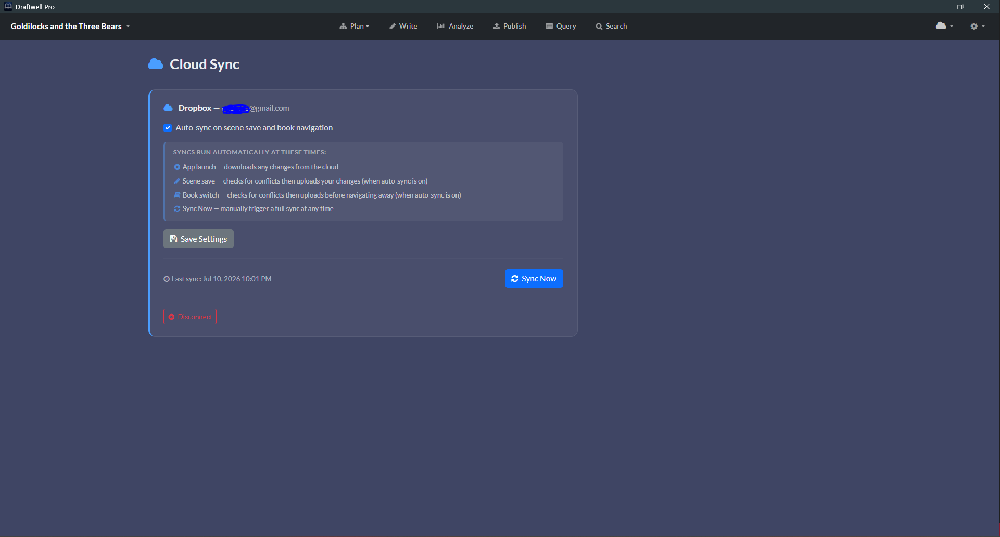

---

### Privacy

Draftwell Pro is local-first. Your manuscript, notes, entities, and writing data live on your own machine by default. No account required. No telemetry.

- **Local-First** — all data stays on your machine; no internet connection required to write; cloud sync is opt-in, off unless you switch it on
- **One File Per Book** — each book is a single `.auth` file; back it up, move it, copy it to a USB drive
- **Optional Cloud Sync** — if you choose to enable it, your files go to your own Google Drive or Dropbox account; see above

---

### Revision History

Draftwell Pro runs a GFS (Grandfather-Father-Son) backup system automatically. Every time you open a book, a timestamped snapshot is created.

**Retention policy:** last 5 opens · 7 daily · 4 weekly · 12 monthly — capped at ~28 backups per book.

- **Side-by-Side Comparison** — browse backup history and compare any snapshot to the current version before restoring

---

## What Draftwell Pro Is Not

- **Not AI** — no generated, suggested, or rewritten prose; no autocomplete; every word is yours
- **Not a Subscription** — buy once, own forever; no monthly fee, no annual renewal
- **Not Cloud-Locked** — no account required, no forced sign-in; optional cloud sync to your own Google Drive or Dropbox, never to our servers
- **Not Scrivener** — chapter/scene planning without the overhead; no compile step, no snowflake method wizard, no 47 preference panels; a sidebar, an editor, an Outline board, and a lot of data about how you're actually writing

---

## Draftwell Pro vs. Scrivener vs. Atticus vs. Dabble vs. yWriter

An honest, feature-by-feature look at where each one actually wins. ⭐ marks the stronger option(s) for that row.

| Feature | Draftwell Pro | Scrivener 3 | Atticus | Dabble | yWriter |
|---|---|---|---|---|---|
| Price | $10 one-time (reg. $19.99) | $59.99/platform · $95.98 bundle | $147 one-time | $9–$29/month, or $699 lifetime | ⭐ Free (optional one-time donation, up to $24.95) |
| Free trial | ⭐ 10 hours of active writing time, non-consecutive | ⭐ 30 days of actual use, non-consecutive | No free trial — 30-day money-back guarantee after purchase | 14 days, no credit card | ⭐ Not applicable — free forever, no trial needed |
| Subscription | ⭐ None | ⭐ None | ⭐ None | Optional monthly/annual plans (lifetime option also available) | ⭐ None |
| Works offline, no account required | ⭐ Yes — fully local, no account | ⭐ Yes — fully local, no account | No — browser app, account & cloud storage required | No — cloud-first, account required (offline edits sync later) | ⭐ Yes — fully local, no account, no cloud at all |
| Import from Word | ⭐ Guided wizard — maps headings to chapters/scenes | Imports .docx, no chapter/scene mapping step | Imports .docx, but requires manual Heading-1 & page-break prep first | No file import — copy/paste only (auto-detects chapter/scene breaks) | Imports via RTF conversion — requires exact "Chapter N" headings & "* * *" scene-break markers |
| Outline / Corkboard | Chapter/scene/synopsis board, drag to rearrange, zoom | ⭐ Freeform corkboard — labels, colors, grid/list layouts | Not available (on roadmap) | Plot Grid — spreadsheet-style story/timeline grid (Standard plan+) | Storyboard view — drag/drop scene cards, more basic than Scrivener's |
| Entity & relationship tracking | ⭐ Dedicated panel, relationship mapping, name scan, mention analytics | No dedicated system — keyword/metadata workarounds | Not available (on roadmap) | Story Notes — character/world sheets, no relationship mapping (Standard plan+) | Character/location/item database, no relationship mapping or auto-detection |
| Entity highlighting in editor | ⭐ Known characters/locations/items glow as you type | Not available | Not available | Not available | Not available |
| Writing style analytics | ⭐ 6-axis dashboard — readability, vocabulary, rhythm, pacing | Not available | Not available | Not available | Not available |
| Story structure analytics | ⭐ Words/chapter & act-weight charts | Not built in | Not available | Plot Grid organizes structure, but no analytics charts | Word-count stats per scene/chapter, no act-weight charts |
| AI-signal detection | ⭐ Perplexity, burstiness, repetition & more, scene-by-scene | Not available | Not available | Not available | Not available |
| Writing activity heatmap | ⭐ 12-month heatmap, sessions, best day | Writing History log, no heatmap view | Not available | Goal & word-count stats, no heatmap | Basic project word-count stats, no heatmap |
| Automatic time tracking | ⭐ Auto clock-in, 30-min idle timeout, WPM velocity | Manual targets/session stats only | Not available | Not available | Not available |
| Session goals | ⭐ Live progress bar with confetti on completion | Word-count targets with progress bar | Not available | Goals & stats tracking, incl. NaNoWriMo-style targets | Per-scene/chapter word-count targets, no live progress bar |
| Query/submission tracker | ⭐ Built-in Kanban — agents, publishers, contests | Not available | Not available | Not available | Not available |
| To-do board | ⭐ Built-in Kanban, linked to entities | Not available | Not available | Not available | Not available |
| Revision backups | ⭐ Automatic GFS snapshots (~28 per book) | Manual/on-compile snapshots | Not available (on roadmap) | Basic revision history; snapshot/restore still planned | Not available |
| Export formats | DOCX, EPUB, HTML, PDF (password option) | ⭐ DOCX, EPUB 3, MOBI/Kindle, PDF, HTML — deeper Compile engine | EPUB, MOBI/Kindle, print-ready PDF | Word, Google Docs, text & web only — no EPUB, PDF, or MOBI | RTF, DOCX, HTML — no EPUB, PDF, or MOBI |
| Book design templates | Style options — fonts, spacing, margins, headings | Compile styles — flexible, but DIY | ⭐ 17 templates, 1,200+ design combinations | Not available | Not available |
| Collaboration (co-writer/editor/beta reader) | Not available | Not available | ⭐ Owner/Co-Writer/Editor/Beta-Reader roles with comments | ⭐ Real-time co-authoring (Premium plan) | Not available |
| Cloud sync | ⭐ Google Drive or Dropbox, opt-in, conflict diff viewer | Dropbox or iCloud only | AWS cloud — mandatory, not optional | Dabble's own cloud — mandatory, not optional | Not available — entirely local, no cloud option |

---

## Pricing

Simple pricing. No surprises.

<table>
<tr>
<td width="50%" valign="top">

#### Free Trial &nbsp;·&nbsp; Windows &amp; Mac OS

### Free

10 hours of active writing time. No credit card. No sign-up. The full app on the clock.

- Every feature, fully unlocked
- 10 hours measured while you're actively typing
- All your data stays yours — activate anytime

Windows 10/11 · Mac OS 12+ · arm64

</td>
<td width="50%" valign="top">

#### One-time purchase &nbsp;·&nbsp; Windows &amp; Mac OS

### $10 ~~reg. $19.99~~

**50% off — code `EARLYACCESS2026`**

Pay once. Own it forever. No subscription, no renewal, no expiry.

- Full writing environment — Book → Chapter → Scene
- Rich text editor with auto-save every 5 seconds
- Import from Word & Outline Mode planning board
- Entity tracking & relationship mapping
- Six analytical dashboards, incl. AI Signal detection
- Automatic time tracking & session history
- Session goals with live progress bar
- Full-text search across the entire book
- Query Tracker Kanban board
- To Do Kanban board
- DOCX, EPUB, HTML & PDF export
- GFS revision history — ~28 backups per book
- 100% local by default — optional cloud sync to your own Google Drive or Dropbox

Windows 10/11 · Mac OS 12+ · arm64

</td>
</tr>
</table>

---

*Designed by a writer, for writers.*
